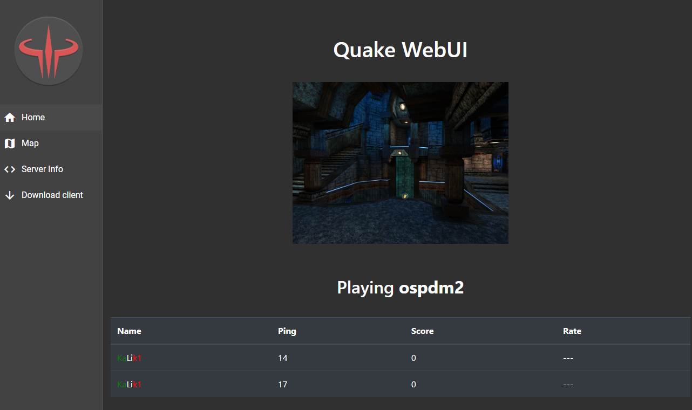
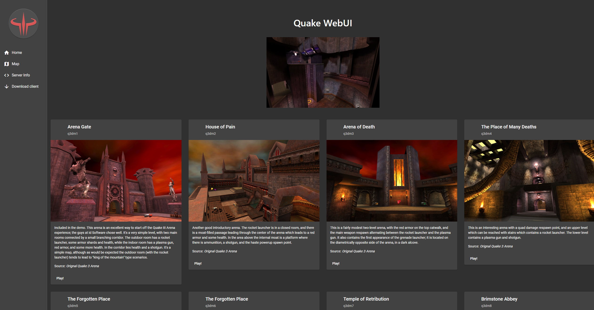

# Q3 Server Docker + Web UI

Quake 3 Arena dedicated server with a web-based admin dashboard. Forked from [kalik1/q3-server-docker-webUI](https://github.com/kalik1/q3-server-docker-webUI) with vendored dependencies, fixed Dockerfiles, and custom server config.




## Architecture

4-service Docker stack with game data stored on the host via bind mounts (not baked into images):

```
Workstation (build machine)              Target Host (192.168.55.100)
  Podman build + push ──────────────────► registry:5000
  rsync game data ──────────────────────► /home/tim/q3-data/
                                          ├── server/baseq3/         → q3-server container (:ro)
                                          ├── server/cpma/cfg-maps   → q3-server container (:ro)
                                          ├── server/excessiveplus/  → q3-server container (:ro)
                                          ├── server/osp/            → q3-server container (:ro)
                                          ├── downloads/             → q3-frontend container (:ro)
                                          └── downloads/             → q3-downloads container (:ro)
```

| Service | Image | Port | Description |
|---------|-------|------|-------------|
| `quake3` | `q3-server` (~135 MB) | 27960/udp | ioquake3 dedicated server + CPMA + E+ + OSP mods |
| `ng-quake3-be` | `q3-backend` (~190 MB) | 9009 (internal) | Node.js REST API + Socket.io RCON bridge |
| `ng-quake3-fe` | `q3-frontend` (~55 MB) | 8080/tcp | Angular web UI + LAN downloads (has RCON — LAN only!) |
| `q3-downloads` | `nginx:1.24-alpine` | 41960/tcp | Static pk3 file server for `sv_dlURL` (internet-safe) |

Images contain only code and config (~380 MB total). Game data (~15 GB) lives on the host at `/home/tim/q3-data/` and is bind-mounted read-only into containers.

### Host Data Directory

```
/home/tim/q3-data/
├── server/baseq3/         # 139 pk3s (game server reads these)
├── server/cpma/           # CPMA pk3 + cfg-maps/
├── server/excessiveplus/  # Excessive Plus pk3s (4 cumulative files)
├── server/osp/            # OSP 1.03a + OSP2-BE pk3s (6 files)
├── downloads/             # 160+ pk3s + mods + all-in-one zip + config
│   ├── *.pk3              # Individual map/texture pk3s
│   ├── baseq3 → .         # Symlink for sv_dlURL path resolution
│   ├── cpma/              # CPMA mod pk3
│   ├── excessiveplus/     # Excessive Plus mod pk3s
│   ├── osp/               # OSP mod pk3s (1.03a + OSP2-BE)
│   ├── q3-all-in-one.zip  # Complete bundle (~6.3 GB)
│   └── autoexec.cfg       # Client config (hunkMegs 1024, autoswitch off, zoom, OpenGL2)
└── downloads-nginx.conf   # nginx config for q3-downloads container (port 41960)
```

## Prerequisites

- **Quake 3 Arena** installed via Steam (need `pak0.pk3` at minimum)
- **Podman** or **Docker** on the build machine
- **Docker registry** accessible at your target (default: `192.168.55.100:5000`)
- **sshpass** on the build machine (for `--sync-data` rsync to host)
- **Portainer** (optional) for stack deployment

## Quick Start

```bash
# 1. Clone
git clone https://github.com/godlyfast/q3-server-docker-webUI.git
cd q3-server-docker-webUI

# 2. Set your Q3 path if not default Steam location
export Q3DIR="$HOME/.local/share/Steam/steamapps/common/Quake 3 Arena/baseq3"

# 3. Edit server.cfg — set rconPassword, server name, etc.
vim server.cfg

# 4. Build images + sync game data to host (first time)
./build.sh --sync-data                # Default registry: 192.168.55.100:5000
./build.sh --sync-data myregistry:5000  # Override registry

# 5. Deploy via Portainer (paste portainer-stack.yml) or docker compose
#    Make sure RCON_PASSWORD and Q3SERV_PASS in the stack match
```

## What build.sh Does

`build.sh` separates image builds (code/config) from game data sync (pk3s):

```bash
./build.sh                # Build + push images only (no data sync)
./build.sh --sync-data    # Build + push images + rsync game data to host
./build.sh --sync-only    # Rsync game data only (skip image build)
./build.sh --sync-data myregistry:5000  # Override registry
```

### Image Build (default)
1. Stages pk3 files from Steam Q3 installation into `build/` and `ng-quake3-fe/downloads/` (local staging only)
2. Builds all-in-one zip (`q3-all-in-one.zip`) with `baseq3/`, `cpma/`, `excessiveplus/`, and `osp/` directories
3. Builds 3 lean Docker images (no game data baked in — just compiled binaries + configs)
4. Pushes to the specified registry

### Data Sync (`--sync-data` or `--sync-only`)
5. Rsyncs `build/*.pk3` → host `/home/tim/q3-data/server/baseq3/`
6. Rsyncs `ng-quake3-fe/downloads/` → host `/home/tim/q3-data/downloads/`

Uses `sshpass` + `rsync` for password-authenticated transfer. Set `Q3_HOST` env var to override the target host (default: `192.168.55.100`).

## Game Files

Game data is **not checked into git** (too large). `build.sh` copies files from your Steam Q3 installation to local staging directories, then optionally syncs them to the target host.

### Server (build/ → host:/home/tim/q3-data/server/baseq3/)
- `pak0.pk3` - `pak8.pk3` — Base game + official patches
- `q3wpak1.pk3` — Point release data
- `map_cpm*.pk3` — 38 CPM competition maps
- 19 community maps from [..::LvL](https://lvlworld.com/) (top-rated FFA/TDM/Tourney maps)
- `zzz_*.pk3`, `wtf-*.pk3` — Hires texture packs

### Client Downloads (ng-quake3-fe/downloads/ → host:/home/tim/q3-data/downloads/)

All files served by nginx at `/downloads/` with `Content-Disposition: attachment`:

| Category | Files | Size |
|----------|-------|------|
| Base game | pak0-pak8, q3wpak1 | ~530 MB |
| CPM maps | 38 `map_cpm*.pk3` files | ~100 MB |
| HD textures | Q3Q HD 4x, wtf-q3a v3, Kpax Hires | ~1.4 GB |
| 4K neural textures | Custom Map 4K (maps, models, 3rd party) | ~2.9 GB |
| HD weapons | CZ45 weapons + BFG remodel | ~22 MB |
| Sounds | QC Sounds pack + QL Announcer | ~23 MB |
| Neural upscale | HD Players + HD Objects | ~340 MB |
| Bug fixes/HUD | TUP + HQQ | ~29 MB |
| QL content | QL Player Models + FX Replacer | ~200 MB |
| CPMA mod | z-cpma-pak153.pk3 (in `cpma/` subdir) | ~16 MB |
| Excessive Plus mod | 4 cumulative pk3s (in `excessiveplus/` subdir) | ~16 MB |
| OSP mod | OSP 1.03a + OSP2-BE pk3s (in `osp/` subdir) | ~57 MB |
| **All-in-one zip** | **q3-all-in-one.zip** (baseq3/ + cpma/ + excessiveplus/ + osp/) | **~6.3 GB** |

## Download Page

The web UI at `/download` provides a complete setup page for LAN players with 6 rows of cards:

1. **Quick Start** — All-in-one bundle (6.3 GB) with everything included
2. **Game Data + Windows + macOS** — pak0.pk3 + ioquake3 engine downloads
3. **Linux/Steam Deck + Android + CPMA** — platform engines + required mod
4. **HD Textures + HD Weapons + QC Sounds** — visual and audio enhancements
5. **Neural Upscale + Bug Fixes + QL Models** — AI upscaled textures + patches
6. **4K Neural Textures + CPM Maps** — ultimate quality + competitive maps

All enhancement pk3s are self-hosted (no external ModDB dependency). Individual files can be downloaded separately or grab the all-in-one zip for the complete experience.

## Community Maps

19 top-rated maps from [..::LvL](https://lvlworld.com/) are included in the server and available via the web UI map switcher at `/map`:

| BSP Name | Title | Author | Rating |
|----------|-------|--------|--------|
| rustgrad | Rustgrad | Hipshot | 4.85 |
| q3gwdm1 | Achromatic | flipout | 4.80 |
| trespass | Trespass | Cardigan | 4.75 |
| phantq3dm3_rev | Corrosion | Phantazm11 | 4.75 |
| hydra | Hydra | Cardigan | 4.70 |
| phantq3dm6_mc | Geotechnic | Phantazm11 | 4.70 |
| solitude | Solitude | jaj | 4.70 |
| bst3dm1 | Terminatria | bst | 4.55 |
| pukka3tourney2 | Evolution | Pukka | 4.55 |
| phantq3dm4 | Windsong Keep | Phantazm11 | 4.55 |
| akutadm1 | ALIEN | akuta | 4.55 |
| map-katdm3 | Inner Sanctum | katarn | 4.50 |
| map-13vast | The Vast And Furious | 13 | 4.50 |
| zl3tourney1 | Hypersonic Tourney | ZaRR | 4.50 |
| map-wintergames | Winter Games | FXRHD | 4.50 |
| zih_roof | East Berlin Roofs | zih | 4.45 |
| shad3dm2 | Deep Freeze | Shad | 4.45 |
| map-13dream | Dreamscape | 13 | 4.45 |
| revenga | Revenga! | psion | 4.45 |

Maps are downloaded from the [FSS mirror](https://lvlworld.fast-stable-secure.net/) as zips, pk3s extracted into `build/` and `ng-quake3-fe/downloads/`. The download script is at `/tmp/q3maps/download_maps.sh` (not checked in).

## Map Management (Web UI)

The web UI at `/map` shows all available maps as cards with screenshots. Click a card to change the server map via RCON.

**Map list is hardcoded** in `ng-quake3-be/src-vendored/src/api/maps/maps.utils.js`. To add a new map:

1. Place the `.pk3` in your Steam Q3 `baseq3/` directory (build.sh copies it to staging and syncs to host)
2. Add a screenshot as `ng-quake3-fe/src-vendored/src/assets/images/{bspname}.jpg`
3. Add an entry to `getMapList()` in `maps.utils.js` with `name`, `title`, `source`, `description`
4. Run `./build.sh --sync-data` (syncs pk3s to host + rebuilds backend/frontend for updated map list)
5. Redeploy via Portainer

Total maps: **135** in web UI (29 stock + 4 id pro + 12 OSP + 90 community). CPM maps (38) are pk3s on the server and in the CPMA map rotation but not in the web map switcher.

## Server Modes

The web UI at http://192.168.55.100:8080 provides a 4-button mode selector to switch between server modes. The server restarts on mode change (Docker `restart: unless-stopped` policy).

| Mode | Config File | Game Type | Map Rotation | Bot Fill |
|------|-------------|-----------|--------------|----------|
| **Vanilla Q3** (default) | `server-baseq3.cfg` | FFA | vstr chain (25 maps) | 4 |
| **CPMA** | `server.cfg` | FFA (VQ3 physics) | cfg-maps/ffamaps.txt (170+ maps) | 4 |
| **Excessive Plus** | `server-excessiveplus.cfg` | FreezeTag (gametype 8) | vstr chain (12 team maps) | 6 |
| **OSP** | `server-osp.cfg` | FFA | vstr chain (25 maps) | 4 |

**How it works**: Backend writes the mode to `/shared/server-mode` (Docker named volume shared between game server and backend), sends RCON `quit`, and Docker restarts the container. `docker-entrypoint.sh` reads the mode and starts `ioq3ded` with the appropriate `fs_game` and config.

Server configs use `__RCON_PASSWORD__` placeholder, substituted at container startup from the `RCON_PASSWORD` env var (no rebuild needed to change password).

Common settings across all modes:
- **sv_pure**: 0 (required for hires textures)
- **sv_dlURL**: `http://dczp.jsninjas.net:41960` (fast HTTP pk3 downloads via q3-downloads container)
- **sv_maxclients**: 16

### Excessive Plus (FreezeTag)

Excessive Plus v2.3 adds lag compensation (Unlagged), 300HP regen, multi-jump, and overpowered weapons. FreezeTag (gametype 8) is a team mode where fragged players freeze in place and teammates must touch them to thaw. Rounds end when all opponents are frozen.

Key E+ cvars: `xp_unlagged 1` (lag compensation), `xp_config ""` (use E+ defaults), `g_dowarmup 1`, `g_teamautojoin 1`.

To change configs, edit the corresponding `.cfg` file, rebuild the game server image, and redeploy.

## Docker Compose (portainer-stack.yml)

The compose file defines bind mounts for game data:

```yaml
services:
  quake3:
    volumes:
      - /home/tim/q3-data/server/baseq3:/home/ioq3srv/ioquake3/baseq3:ro
      - /home/tim/q3-data/server/cpma/cfg-maps:/home/ioq3srv/ioquake3/cpma/cfg-maps:ro
      - /home/tim/q3-data/server/excessiveplus:/home/ioq3srv/ioquake3/excessiveplus:ro
      - /home/tim/q3-data/server/osp:/home/ioq3srv/ioquake3/osp:ro

  ng-quake3-fe:
    volumes:
      - /home/tim/q3-data/downloads:/usr/share/nginx/html/downloads:ro

  q3-downloads:
    image: nginx:1.24-alpine
    ports:
      - "41960:41960"
    volumes:
      - /home/tim/q3-data/downloads:/usr/share/nginx/html:ro
      - /home/tim/q3-data/downloads-nginx.conf:/etc/nginx/conf.d/default.conf:ro
```

All game data mounted `:ro` (read-only). The `q3-downloads` service is an internet-safe nginx serving only static pk3 files on port 41960 — no API, no RCON, safe to port-forward.

## Insecure Registry Setup

If using an HTTP (non-TLS) registry, configure both build and target machines:

**Podman** (build machine) — `/etc/containers/registries.conf.d/01-registry.conf`:
```ini
[[registry]]
location = "192.168.55.100:5000"
insecure = true
```

**Docker** (target host) — `/etc/docker/daemon.json`:
```json
{"insecure-registries": ["192.168.55.100:5000"]}
```

## Known Build Issues

| Issue | Fix |
|-------|-----|
| `no space left on device` during game server build | Podman uses tmpfs for layers. `build.sh` sets `TMPDIR=~/.cache/podman-tmp` to use disk instead |
| `ENOENT spawn git` during frontend build | Frontend Dockerfile includes `apk add git` for buble npm dependency |
| ioquake3 binary name wrong | CMake builds install as `ioq3ded` (not `ioq3ded.x86_64` like old Makefile builds) |
| rsync auth failure (exit 255) | `build.sh` uses `sshpass` for rsync authentication — install `sshpass` on the build machine |

## Security Notes

- `server.cfg` in this repo uses placeholder `CHANGEME` for rconPassword — the real password is injected via `RCON_PASSWORD` env var at container startup
- `portainer-stack.yml` also uses `CHANGEME` for `RCON_PASSWORD` and `Q3SERV_PASS` — update when deploying
- **Do NOT expose port 8080 to the internet** — the web UI has no authentication and gives full RCON control
- Port forwarding for internet play: **UDP 27960** (game) + **TCP 41960** (HTTP downloads)
- Port 41960 (q3-downloads) serves only static files via nginx — no API, no RCON, safe to expose
- DDNS hostname: `dczp.jsninjas.net` (used in `sv_dlURL` for client pk3 downloads)

## Client Setup

### Recommended Engine: ioquake3 with OpenGL2

**ioquake3** with the OpenGL2 renderer provides the best visual quality with the HD texture packs:
- HDR + tone mapping, bloom, normal/specular mapping, SSAO, cubemap reflections, volumetric sun rays
- Alternative: **quake3e** (Vulkan) — faster/lower latency but fewer visual features

The all-in-one bundle and downloads page include `autoexec.cfg` with:
- `com_hunkMegs 1024` + `com_zoneMegs 128` — required for HD/4K textures (default 128 MB causes `Hunk_AllocateTempMemory: failed`)
- `cg_autoswitch 0` — don't auto-switch weapon on pickup
- `bind MOUSE2 "+zoom"` — right-click to zoom
- OpenGL2 renderer settings (HDR, normal maps, SSAO, sun shadows)
- Max texture quality, trilinear filtering, 16x anisotropic

### Engine Comparison

| Feature | ioquake3 OpenGL2 | quake3e Vulkan |
|---------|:---:|:---:|
| HDR + tone mapping | yes | basic |
| Normal/specular mapping | yes | no |
| Sun shadows + god rays | yes | no |
| SSAO | yes | no |
| Input latency | good | best |
| Config path (Linux) | `~/.config/Quake3/` | `~/.config/Quake3/` |

### Linux (ioquake3)

```bash
# Install (Arch Linux)
yay -S ioquake3-git

# Launch with Steam Q3 data (all pk3s + mods)
ioquake3 +set fs_basepath "$HOME/.local/share/Steam/steamapps/common/Quake 3 Arena" +set cl_renderer opengl2

# Connect to server
/connect dczp.jsninjas.net:27960
```

### Steam Launch Options

Replace the default Q3 launch command in Steam → Q3 Properties → Launch Options:
```
./ioquake3-launch.sh; echo %command%
```
The `ioquake3-launch.sh` wrapper (included in the Q3 directory) sets `fs_basepath` and `cl_renderer opengl2`.

## Credits

- Original project: [kalik1/q3-server-docker-webUI](https://github.com/kalik1/q3-server-docker-webUI)
- Backend: [kalik1/q3-server-docker-rest-api](https://github.com/kalik1/q3-server-docker-rest-api)
- Frontend: [kalik1/q3-server-docker-webUI-angular](https://github.com/kalik1/q3-server-docker-webUI-angular)
- Game engine: [ioquake3](https://github.com/ioquake/ioq3)
- Mod: [CPMA](https://playmorepromode.com/) (Challenge ProMode Arena)
- Mod: [Excessive Plus](https://www.excessiveplus.net/) v2.3 (FreezeTag + overpowered weapons)
- Mod: [OSP](http://www.intq3.com/osp/) 1.03a (Orange Smoothie Productions — competitive mod)
- Mod: [OSP2-BE](https://github.com/scoqx/OSP2-BE) v1.01d (OSP client enhancement — SuperHUD, player outlines)
